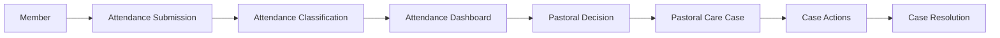
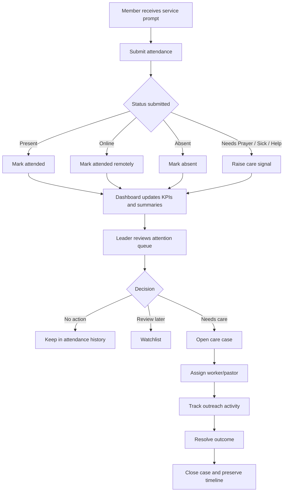
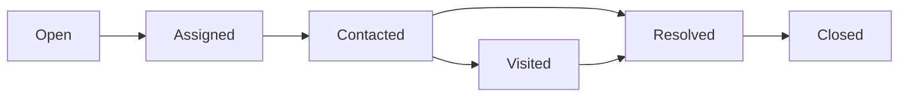
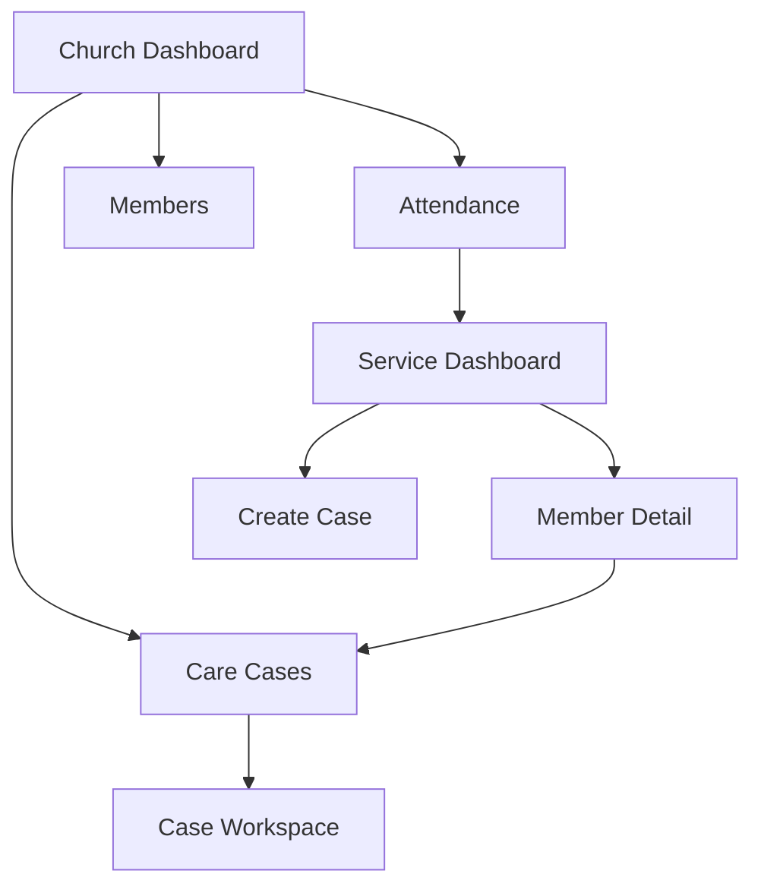
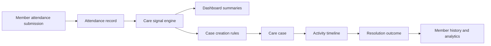

# Attendance & Pastoral Care Architecture

Date: 2026-07-08
Status: Proposed Architecture Blueprint

## 1. User Journey

The Attendance experience should be redesigned as an operational workflow, not a record-management flow.

### Core Journey

### Detailed Journey

### Workflow Intent

- Member submits one service response.
- System translates the response into operational signals.
- Dashboard helps leaders decide what needs attention now.
- Care work becomes case-based, not note-based.
- Resolution closes the loop and feeds future engagement insights.

## 2. Attendance Dashboard

The Attendance screen should become an Operations Dashboard.

### Page Goal

Answer these questions immediately:

- Who attended?
- Who is missing?
- Who needs care?
- Which cases are still open?
- What needs action today?

### KPI Cards

Recommended KPI cards:

1. Expected Members
Meaning: Members expected for the selected service cohort.
Calculation: active members eligible for that service or selected segment.

2. Attendance Submitted
Meaning: Members who submitted attendance for the selected service.
Calculation: count of attendance records linked to the selected service.

3. Need Attention
Meaning: Members whose attendance generated a care signal of Review, Needs Care, or Urgent.
Calculation: count of attendance rows with calculated care signal above No Action.

4. Open Care Cases
Meaning: Cases still in progress.
Calculation: care cases with lifecycle status not equal to Resolved or Closed.

Optional KPI cards:

- Absent Without Response
- Prayer Requests Today
- First-Time Concerns
- Assigned To Me

### Service Selection

Recommendation: use service cards, not chips, when there are fewer than 8 active services in scope.

Why cards are better:

- They can show service title, day, time, attendance rate, and open issues.
- They provide more context than chips.
- They support multi-campus expansion later.
- They make the selected service feel like the dashboard context, not just a filter.

Use chips only for secondary filtering after a service is selected.

Recommended service card fields:

- Service name
- Day and time
- Attendance submitted / expected
- Open care cases count
- Status indicator for live, upcoming, completed

### Attendance Summary

Replace simple raw-status chips with operational summary chips.

Recommended summary chips:

- Present
- Absent
- Online
- Needs Prayer
- Attention Required
- Travelling
- Working
- Follow-up Open

Calculated meanings:

- Present: count of PRESENT_IN_CHURCH
- Absent: count of ABSENT or expected members with no submission after cutoff
- Online: count of JOINED_ONLINE
- Needs Prayer: count of NEEDS_PRAYER or message tagged as prayer-related
- Attention Required: count where care signal is Review, Needs Care, or Urgent
- Travelling: count of TRAVELLING
- Working: count of WORKING
- Follow-up Open: count of attendance rows linked to open care cases

### Attendance Table

The table should support action, not just visibility.

Recommended columns:

1. Member
Reason: primary identity anchor; clicking opens member details.

2. Attendance Outcome
Reason: core submitted state for the service.
Examples: Present, Online, Absent, Sick, Needs Prayer.

3. Response Summary
Reason: gives immediate context without opening the row.
Show short message preview, prayer request summary, or “No response”.

4. Care Signal
Reason: calculated operational priority; this is more useful than raw flags.
Values: No Action, Review, Needs Care, Urgent.

5. Care Case
Reason: shows whether pastoral work already exists.
Values: None, Open, Assigned, Contacted, Resolved.

6. Owner
Reason: shows who is responsible for the active case.
Hidden if no case exists.

7. Last Action
Reason: tells the leader whether follow-up is stale.
Examples: “No action yet”, “Called 2h ago”, “Visited yesterday”.

8. Actions
Reason: operational shortcuts.
Examples: Open member, Create case, Assign case, Log contact, Resolve case.

Columns to remove from the current mental model if they do not support decisions:

- Raw technical identifiers
- Redundant service label when service is already the page context
- Duplicate attendance fields that repeat the same status in different forms

## 3. Care Signals

The system should calculate a Care Signal from attendance input plus existing member/case context.

### Recommended Care Signal Levels

1. No Action
Use when:
- Present in church
- Joined online without request for help
- Travelling with no concern

2. Review
Use when:
- Absent once
- Other custom reason with no urgent keywords
- Working repeatedly but no explicit care request

3. Needs Care
Use when:
- Needs prayer
- Wants pastor contact
- Absent multiple services within a rolling window
- Message contains concern indicators

4. Urgent
Use when:
- Sick
- Bereavement
- Explicit crisis language
- Repeated unresolved care signal within recent services

### Signal Rules

Suggested rules engine inputs:

- Attendance status
- wantsPastorContact
- message keywords
- consecutive absences
- open unresolved cases
- member vulnerability flags
- manual staff override

Example rules:

- SICK => Urgent
- NEEDS_PRAYER + wantsPastorContact => Urgent
- NEEDS_PRAYER alone => Needs Care
- ABSENT once => Review
- ABSENT three consecutive services => Needs Care
- ABSENT with existing unresolved case => Urgent
- OTHER with concerning keywords => Needs Care
- PRESENT_IN_CHURCH => No Action

## 4. Member Details

The Attendance dashboard should open a Member Detail workspace.

### Recommended Tabs

1. Overview
Why: identity, household, contact, ministry role, quick health of member profile.

2. Attendance
Why: service participation trends are the backbone of this workflow.

3. Prayer Requests
Why: prayer needs should not be buried in attendance notes.

4. Pastoral Care
Why: active and historical care cases belong here.

5. Departments
Why: ministry involvement affects expected attendance and follow-up context.

6. Giving
Why: useful for pastoral insight, but secondary and permission-sensitive.

7. Events
Why: event participation improves engagement interpretation.

8. Notes
Why: private pastoral observations and contextual follow-up notes.

Optional future tabs:

- Communication
- Family / Household
- Serving Schedule

## 5. Pastoral Care Module

Recommendation: rename Care Follow-up to Care Cases.

Why:

- “Follow-up” sounds lightweight and task-based.
- “Case” communicates ownership, continuity, status, and audit trail.
- The work is not a single reminder; it is a managed pastoral process.

### Module Purpose

The module should function as a case management system.

Core entities:

- Case
- Case owner
- Case signal/source
- Case activity timeline
- Case resolution outcome

Core views:

- Open Cases
- Assigned to Me
- Urgent Cases
- Recently Updated
- Resolved Cases

## 6. Case Lifecycle

Recommended lifecycle:

### Stages

1. Open
Meaning: case created, not yet owned.
Allowed actions: assign, merge, escalate, add note, close as duplicate.

2. Assigned
Meaning: owner accepted responsibility.
Allowed actions: log outreach, reassign, escalate, schedule visit.

3. Contacted
Meaning: first meaningful contact attempt or successful conversation recorded.
Allowed actions: log call, message, prayer, schedule visit, resolve.

4. Visited
Meaning: in-person pastoral interaction recorded.
Allowed actions: add visit notes, create next steps, resolve, escalate.

5. Resolved
Meaning: core need addressed.
Allowed actions: add outcome summary, reopen, close.

6. Closed
Meaning: administrative end of workflow.
Allowed actions: view only, reopen with permission.

## 7. Activity Timeline

Every case should carry a full activity timeline.

### Timeline Events

- Case Created
- Assigned
- Reassigned
- Phone Call Logged
- WhatsApp Message Sent
- SMS Sent
- Email Sent
- Prayer Offered
- Hospital Visit
- Home Visit
- Welfare Support Provided
- Note Added
- Escalated
- Resolved
- Closed
- Reopened

### Data Required Per Timeline Event

- Event type
- Timestamp
- Actor
- Related member
- Related case
- Channel or action type
- Summary text
- Outcome
- Next step date if applicable
- Visibility level if some notes are private

## 8. Dashboard Improvements

Recommended additional widgets:

1. Members Absent Three Consecutive Services
Why: identifies disengagement risk quickly.

2. Members Requesting Prayer
Why: prayer requests are high-value pastoral signals.

3. Hospital Visits This Week
Why: operational workload and care reporting.

4. Open Cases by Owner
Why: balance workload across pastors and leaders.

5. Cases Waiting for First Contact
Why: identifies neglected care items.

6. Pastoral Workload
Why: assignment fairness and capacity management.

7. Recently Resolved Cases
Why: closes the loop and improves team visibility.

8. AI Recommendations
Why: surface likely members needing outreach before they explicitly ask.

## 9. AI Opportunities

AI should assist prioritization and summarization, not replace pastoral judgment.

### Attendance

Recommended AI uses:

- Detect unusual attendance behavior
- Predict disengagement risk
- Summarize attendance anomalies for leaders

### Pastoral Care

Recommended AI uses:

- Suggest care priority from case notes
- Draft case summaries from timeline history
- Recommend next best action based on similar resolved cases

### Prayer Requests

Recommended AI uses:

- Group similar prayer themes
- Detect urgent language
- Generate private staff summaries

### Member Engagement

Recommended AI uses:

- Identify members drifting from participation
- Recommend outreach cohorts
- Suggest ministry reconnection opportunities

## 10. Future Scalability

### Small Churches

Design benefits:

- Simple service selection
- Lightweight case workflow
- Minimal staffing overhead

### Medium Churches

Design benefits:

- Owner assignment
- Workload balancing
- Attendance segmentation by ministries or demographics

### Large Churches

Design benefits:

- Queue-based care operations
- Team assignment by district or department
- Case analytics and SLA-style follow-up tracking

### Multi-Campus Churches

Design benefits:

- Campus-aware service cards
- Campus-scoped dashboards
- Shared central case model with local ownership

## 11. UX Recommendations

### Navigation

Recommendation: surface Attendance as a primary top-level church module.
Why: it becomes the operational entry point for weekly leadership action.

### Tables

Recommendation: use sticky summary filters and keep row actions visible.
Why: reduces context loss during triage.

### Cards

Recommendation: KPI cards should be clickable and drill into filtered views.
Why: metrics should lead directly to action.

### Filters

Recommendation: support Service, Signal, Case Status, Owner, Campus, Date.
Why: pastors need fast narrowing, not broad scrolling.

### Search

Recommendation: allow search by member name, case ID, phone, and note keywords.
Why: operational workflows are interrupt-driven.

### Status Badges

Recommendation: separate attendance badges from care-signal badges.
Why: attendance state and pastoral urgency are not the same thing.

### Colours

Recommendation:

- Green: stable / no action
- Blue: informational / online / assigned
- Amber: review
- Red: urgent
- Gray: closed / inactive

Why: leaders should understand urgency at a glance.

### Actions

Recommendation: use icon + label patterns for primary row actions.
Why: clearer than icon-only in high-accountability workflows.

### Drawers

Recommendation: use drawers for quick triage and case creation.
Why: preserves context from the dashboard.

### Modals

Recommendation: reserve modals for confirmations only.
Why: complex pastoral work benefits from persistent side context rather than interruptive popups.

## 12. Final Recommendation

### Navigation Hierarchy

### Module Relationships

- Attendance is the operational source of weekly signals.
- Member Detail is the context workspace.
- Care Cases is the execution workspace.
- Dashboard widgets summarize both Attendance and Care Cases.

### Data Flow

### Screen Hierarchy

- Attendance Home
- Service Dashboard
- Member Detail
- Care Case Workspace
- Case Queue Views
- Reporting / Analytics

### Database Relationships

Recommended conceptual relationships:

- Member 1..* Attendance
- Service 1..* Attendance
- Attendance 0..1 Care Case trigger reference
- Member 1..* Care Cases
- Care Case 1..* Timeline Events
- User 1..* Assigned Cases

### Case Workflow

- Signal generated from attendance
- Leader reviews dashboard queue
- Case opened when needed
- Case assigned to owner
- Outreach actions logged in timeline
- Case resolved and closed with outcome

### Future Extensibility

This architecture supports:

- AI-driven prioritization
- multi-campus case routing
- volunteer care teams
- SLA-style pastoral response tracking
- advanced member engagement analytics
- integrations with messaging and call providers

## Final Blueprint Summary

The recommended architecture shifts Attendance from a passive log into a weekly operational command centre. Attendance should create signals, not just rows. Pastoral care should be managed as cases, not ad hoc follow-ups. Member details should provide full pastoral context. The dashboard should prioritize action, visibility, ownership, and accountability.

This document should be used as the blueprint for all future Attendance and Pastoral Care design and development.
